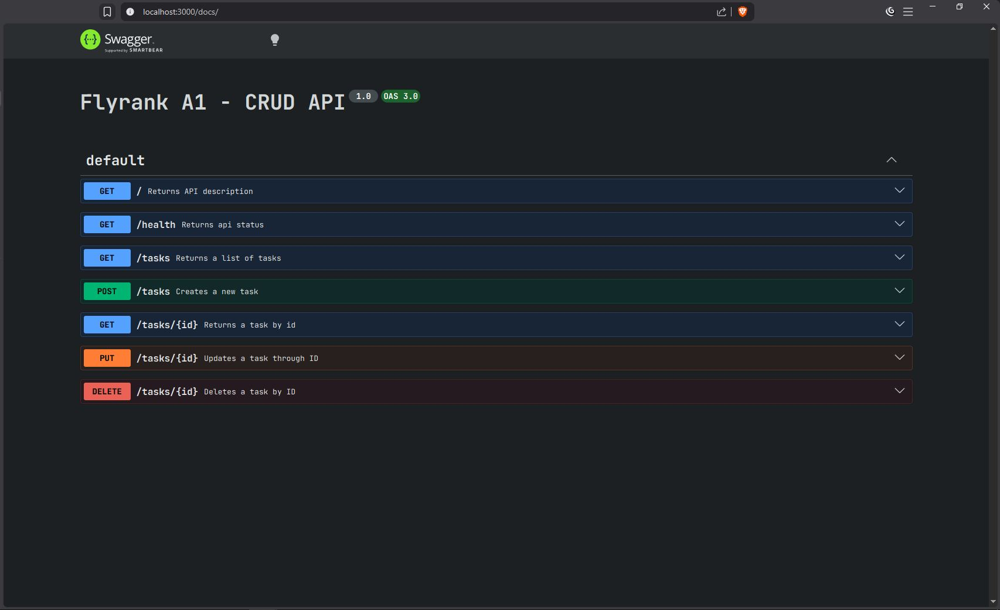

## A basic CRUD API built with express.js
---
### How to install and run it
> **Note:** Make sure you're in the root directory (\api)
```
npm install
npm run dev
```

Then you're good to go!

### Endpoints
 - GET "/"
 - GET "/health"
 - GET "/tasks"
 - POST "/tasks"
 - GET "/tasks/{id}"
 - PUT "/tasks/{id}"
 - DELETE "/tasks/{id}"

### Example Output with curl
```
curl -i http://localhost:3000/tasks

> HTTP/1.1 200 OK
X-Powered-By: Express
Content-Type: application/json; charset=utf-8
Content-Length: 123
ETag: W/"7b-ojSrUGqJZM9JbtKsOY+sK/nLsdk"
Date: Sat, 18 Jul 2026 16:25:49 GMT
Connection: keep-alive
Keep-Alive: timeout=5

[{"id":1,"title":"study","done":false},{"id":2,"title":"work on project","done":true},{"id":3,"title":"code","done":false}]
```
### Swagger UI


